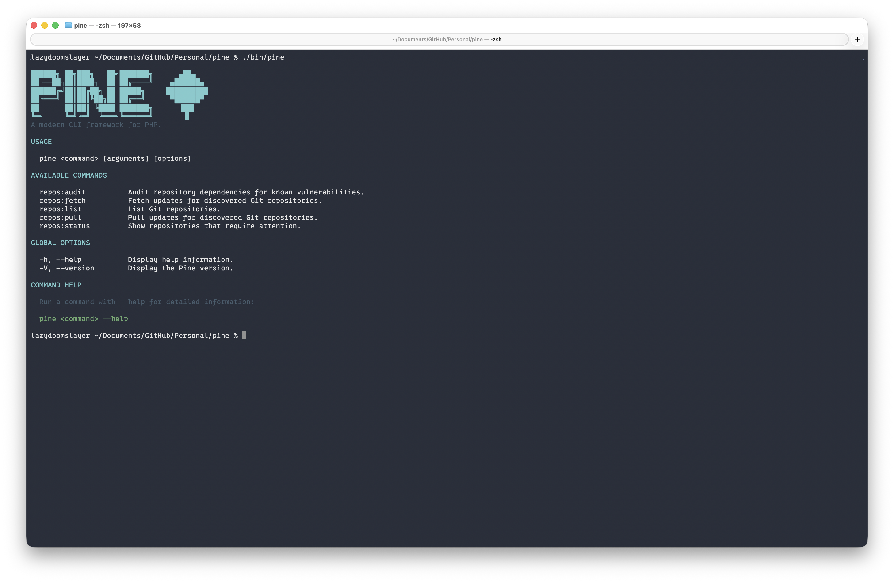
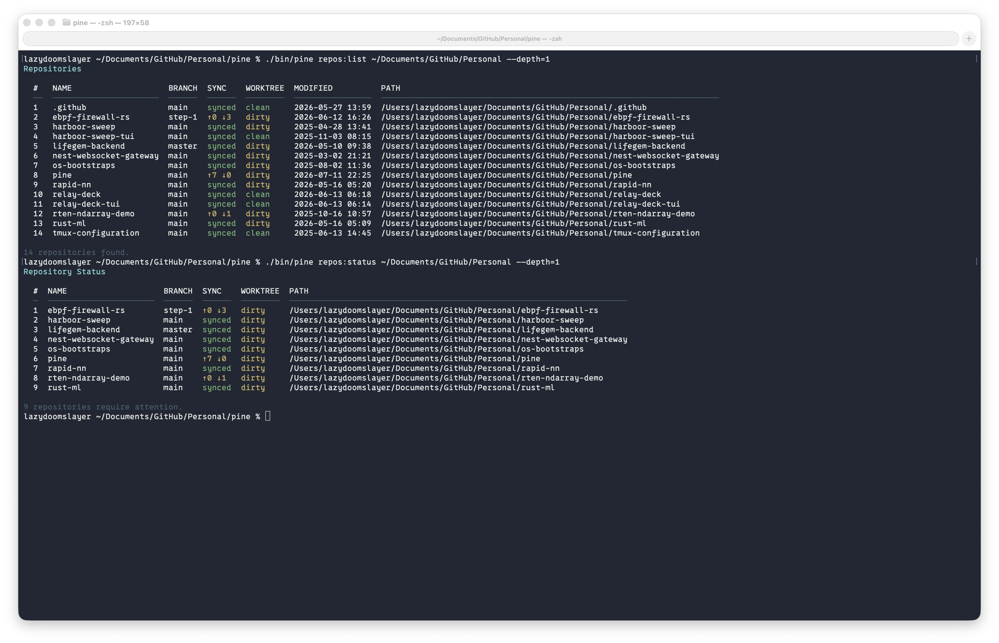
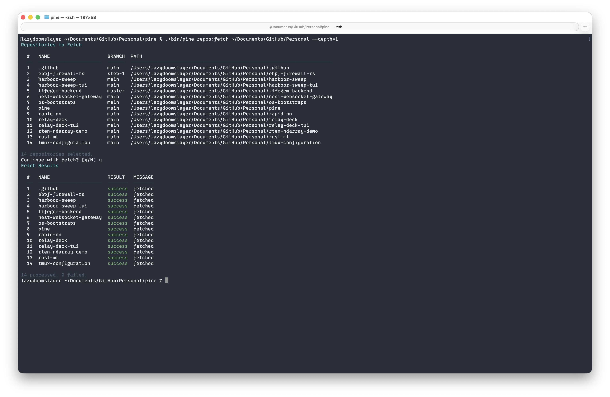
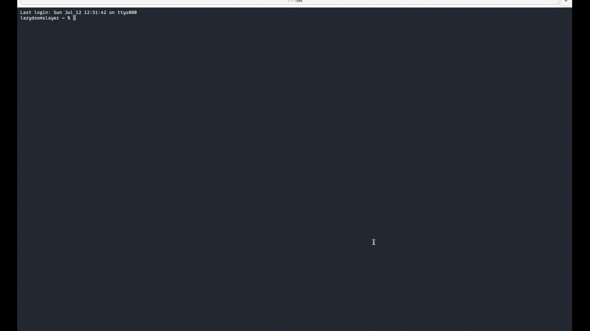

# Pine

A modern PHP CLI framework for building developer tools and automation workflows.

> **Work in progress:** Pine is being built from scratch as a learning and portfolio project to explore how modern PHP
> frameworks work internally. APIs may change while the framework evolves.



---

## About

Engineering teams often rely on scripts for repetitive tasks such as inspecting repositories, fetching changes, checking
dependencies, generating reports, and running scheduled maintenance.

Those scripts usually begin small, but they become difficult to maintain as they grow.

Pine explores how the internal building blocks of a modern framework can be applied specifically to command-line
applications:

* command discovery and execution
* dependency injection
* structured input and output
* external process execution
* reusable application services
* background jobs and scheduling
* events and plugins

The project intentionally focuses on CLI applications. It is not intended to become an HTTP or MVC framework.

---

## Framework Architecture

Pine is intentionally built from scratch rather than on top of an existing framework.

Current architecture includes:

- Console application
- Command discovery
- Dependency Injection Container
- Process abstraction
- Repository services
- Dependency auditing services
- JSON rendering
- Rich terminal output
- PHPUnit test suite

Future releases will introduce service providers, events, queues, scheduling, plugins, and additional framework
components.

--- 

## Current Features

### Console application

* Executable CLI entry point
* Automatic command discovery
* Command registry
* Application help output
* Positional arguments
* CLI options such as `--json` and `--depth=2`
* Colored terminal output
* Structured tables
* JSON output

### Dependency injection container

* Constructor-based dependency resolution
* Automatic resolution of concrete classes
* Explicit bindings
* Shared application dependencies

### Process execution

* External command execution
* Structured process results
* Exit-code and output handling
* Testable process runner abstraction

### Repository Automation

Pine currently provides several commands for discovering, inspecting and maintaining local Git repositories.

| Command        | Description                                                                |
|----------------|----------------------------------------------------------------------------|
| `repos:list`   | Discover Git repositories recursively                                      |
| `repos:status` | Display repository status, branch, sync state and working tree information |
| `repos:fetch`  | Fetch remote changes for discovered repositories                           |
| `repos:pull`   | Pull changes for eligible repositories                                     |
| `repos:audit`  | Scan Composer and npm dependencies for known vulnerabilities               |

Repository scanning supports configurable recursion depth and automatically skips common generated directories such as:

- `.git`
- `node_modules`
- `vendor`
- `target`

## Requirements

* PHP 8.4 or newer
* Composer
* Git
* `mbstring` PHP extension
* `ctype` PHP extension

## Installation

Pine is not yet published as a Composer package. Clone the repository and install its dependencies locally:

```bash
git clone https://github.com/LazyDoomSlayer/pine.git
cd pine
composer install
```

Run Pine using:

```bash
php bin/pine
```

You can also use the Composer shortcut:

```bash
composer pine
```

## Usage

Running Pine without a command displays the available commands:

```bash
php bin/pine
```

### Discover repositories



Scan the current directory:

```bash
php bin/pine repos:list .
```

Scan another directory:

```bash
php bin/pine repos:list ~/Projects
```

Control how deeply Pine searches:

```bash
php bin/pine repos:list ~/Projects --depth=3
```

Return machine-readable output:

```bash
php bin/pine repos:list ~/Projects --json
```

### Inspect repository status


```bash
php bin/pine repos:status ~/Projects
```

The status command reports information such as:

* current branch
* clean or dirty state
* commits ahead of the remote
* commits behind the remote
* modified files
* untracked files

JSON output is also available:

```bash
php bin/pine repos:status ~/Projects --json
```

### Fetch repositories



```bash
php bin/pine repos:fetch ~/Projects
```

Pine displays the repositories it found and asks for confirmation before fetching remote changes.

### Pull repositories

```bash
php bin/pine repos:pull ~/Projects
```

The pull command evaluates discovered repositories and pulls changes where it is safe to do so.

## Development

Install dependencies:

```bash
composer install
```

Run the test suite:

```bash
composer test
```

Run the complete verification command:

```bash
composer verify
```

Run Pine during development:

```bash
composer pine
```

To run the test suite automatically before Git pushes, configure the included hooks directory:

```bash
git config core.hooksPath .githooks
```

## Dependency Auditing



Pine can scan every discovered Git repository for known dependency vulnerabilities.

Currently supported package managers:

- Composer
- npm

For each repository Pine:

- detects supported package managers
- executes the appropriate audit command
- parses machine-readable JSON output
- aggregates vulnerabilities
- displays a unified report

Run an audit across all repositories:

```bash
php bin/pine repos:audit ~/Projects
```

JSON output is also supported:

```bash
php bin/pine repos:audit ~/Projects --json
```

## Project Structure

```text
pine/
├── bin/
│   └── pine
├── src/
│   ├── Audit/
│   ├── Commands/
│   ├── Console/
│   ├── Container/
│   ├── Process/
│   ├── Repositories/
│   └── Support/
├── tests/
├── composer.json
└── phpunit.xml
```

## Roadmap

Pine is being developed incrementally so that each framework feature is exercised by a believable CLI use case.

Planned areas include:

- Service Providers
- Event Dispatcher
- Queue System
- Scheduler
- PHP Attributes
- Plugin System
- Configuration Management
- Facades
- PHAR Distribution
- Interactive Prompts
- Improved Help & Validation
- ADR Documentation
-

Possible future commands include:

```text
dependencies:audit
reports:generate
queue:work
schedule:run
plugin:enable
```

These commands represent planned directions and are not all implemented yet.

## Project Goals

Pine is designed to explore and demonstrate:

* modern PHP language features
* framework bootstrapping and lifecycle design
* dependency injection and inversion of control
* maintainable console application architecture
* process isolation and testability
* PSR-style project organization
* automated testing with PHPUnit
* developer-tooling workflows

## Non-Goals

Pine is intentionally not trying to provide:

* HTTP routing
* controllers
* an ORM
* database migrations
* server-side templates
* MVC application architecture

Its scope remains focused on command-line applications and developer automation.

## Status

## Current Status

Pine is under active development.

Current functionality focuses on repository automation and dependency auditing while the underlying framework
architecture continues to evolve.

Implemented:

- ✅ Console framework
- ✅ Dependency Injection Container
- ✅ Process abstraction
- ✅ Repository discovery
- ✅ Repository status
- ✅ Repository fetch
- ✅ Repository pull
- ✅ Dependency auditing (Composer & npm)

Next milestones include service providers, events, queues, scheduling and plugins.

## License

Pine is open-source software licensed under the [MIT License](LICENSE).
